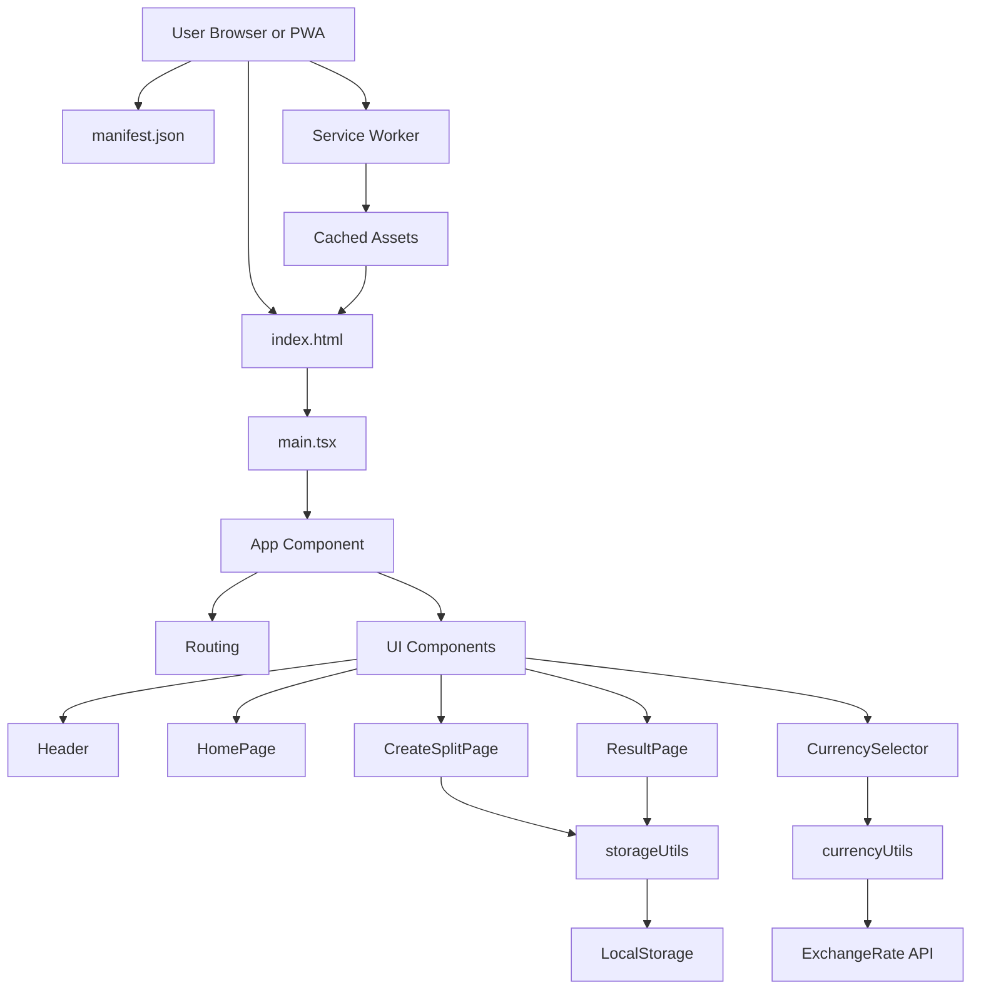

# BillSplit

BillSplit is a modern, intuitive web application designed to simplify the process of splitting bills among friends, family, or colleagues. Whether it’s group dinners, trips, or shared expenses, BillSplit ensures fair and transparent settlements with ease.

---

## 🗺️ Workflow Diagram



---

## 🚀 Features

- **Dynamic Bill Splitting:** Effortlessly split bills among multiple participants.
- **Itemized Entries:** Add unlimited items with individual costs.
- **Smart Assignment:** Assign each item to one or more individuals for precise calculations.
- **Automated Calculations:** Instantly determine who owes what, including totals per person.
- **Multi-Currency Support:** Integrated currency conversion using real-time data from ExchangeRate API.
- **Session Persistence:** Save and resume sessions using local storage—never lose your progress.
- **User-Friendly Interface:** Clean, responsive UI built with React and modern web standards.

---

## 🛠️ Technologies

- **Frontend:** [React](https://reactjs.org/)
- **Styling:** HTML5, CSS3 (optionally Tailwind)
- **API:** [ExchangeRate API](https://api.exchangerate-api.com) for up-to-date currency conversion
- **Data Persistence:** Browser LocalStorage

---

## 📦 Installation

To run BillSplit locally:

1. **Clone the Repository**
   ```bash
   git clone https://github.com/your-username/billsplit.git
   cd billsplit
   ```

2. **Install Dependencies**
   ```bash
   npm install
   ```

3. **Start the Development Server**
   ```bash
   npm start
   ```

4. **Open in Your Browser**
   Visit [http://localhost:3000](http://localhost:3000) to get started.

---

## 📝 Usage Guide

1. **Set Participants:** Enter the number of people involved in the split and their names.
2. **Add Items:** Input items and their respective costs.
3. **Assign Items:** Allocate each item to relevant individuals.
4. **Currency Selection:** Choose your preferred currency (conversion handled automatically).
5. **Review Results:** Instantly view a breakdown of who owes what.
6. **Save/Resume:** Your session is automatically saved in your browser.

---

## 🌐 Live Demo

Try BillSplit instantly with no setup required:  
👉 [https://bill-split-gilt.vercel.app/](https://bill-split-gilt.vercel.app/)

---

## 🌍 API Integration

BillSplit leverages the [ExchangeRate API](https://api.exchangerate-api.com) to provide seamless and accurate currency conversions.

---

## 🤝 Contributing

Contributions are welcome! If you'd like to collaborate, please fork this repository and submit a pull request. For major changes, open an issue first to discuss your ideas.

---

## 👤 Author

Developed and maintained by [Saket](https://github.com/sinha-19).

---

> _BillSplit — Making group expenses simple, fair, and transparent._
